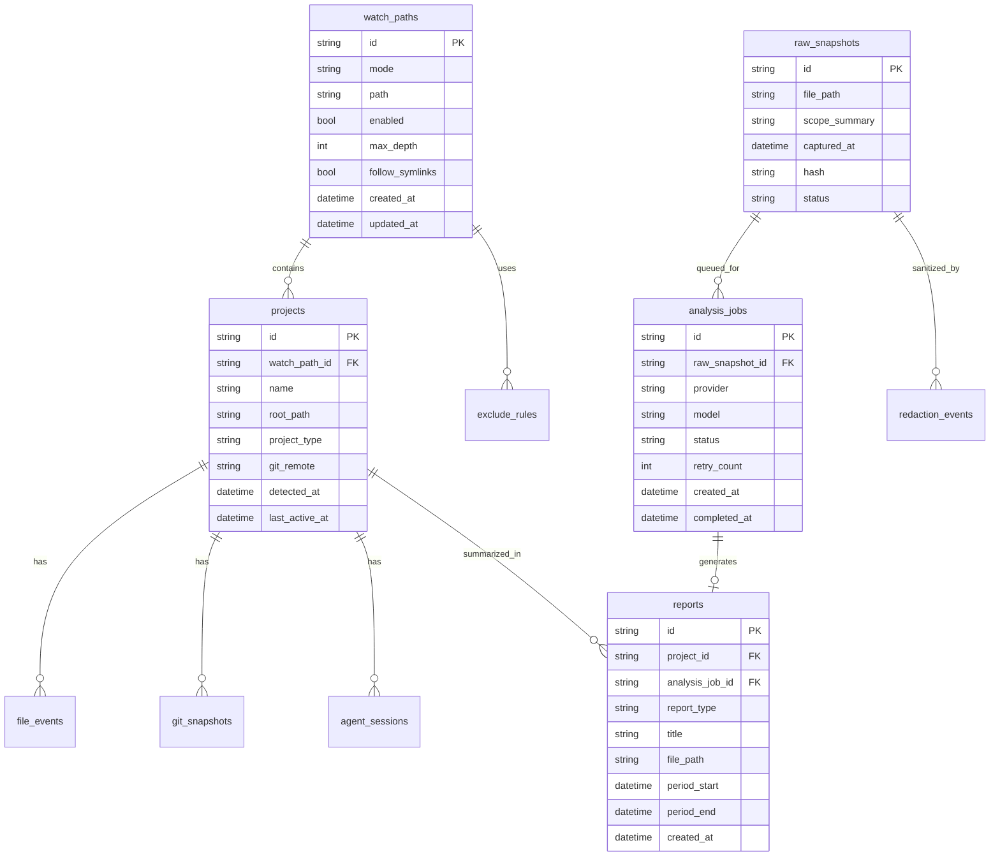

# TraceForge v4 Documentation Set

제품명: **TraceForge**  
서브타이틀: **AI Work Evidence Recorder**  
문서 기준일: 2026-05-08  
핵심 변경: CLI/스크립트 실행형에서 **설치형 크로스플랫폼 데스크톱 앱 + 트레이 백그라운드 에이전트**로 전환

---

# ERD v4: Entity Relationship Design

## 1. 개요

TraceForge v4는 SQLite를 기본 로컬 메타데이터 저장소로 사용한다. Raw Evidence JSON과 Markdown Report는 파일시스템에 저장하고, DB에는 경로와 메타데이터를 저장한다.

## 2. 엔티티 목록

| Entity | 설명 |
|---|---|
| app_settings | 앱 설정 |
| watch_paths | 감시 대상 경로 |
| exclude_rules | 제외 규칙 |
| projects | 감지된 프로젝트 |
| file_events | 파일 변경 이벤트 |
| git_snapshots | Git 상태 스냅샷 |
| shell_commands | 수집된 명령어 요약 |
| agent_sessions | `.worklog/agent-session.md` 기록 |
| raw_snapshots | 원본/정제 evidence snapshot |
| analysis_jobs | AI 분석 작업 |
| reports | 생성된 Markdown 리포트 |
| redaction_events | 마스킹 처리 기록 |
| notifications | 사용자 알림 기록 |

## 3. 관계 요약

```txt
watch_paths 1 ─── N projects
projects 1 ─── N file_events
projects 1 ─── N git_snapshots
projects 1 ─── N agent_sessions
raw_snapshots 1 ─── N analysis_jobs
analysis_jobs 1 ─── 0..1 reports
raw_snapshots 1 ─── N redaction_events
reports N ─── 1 projects optional
```

## 4. Mermaid ERD



## 5. SQLite DDL 초안

```sql
CREATE TABLE app_settings (
  key TEXT PRIMARY KEY,
  value TEXT NOT NULL,
  updated_at TEXT NOT NULL
);

CREATE TABLE watch_paths (
  id TEXT PRIMARY KEY,
  mode TEXT NOT NULL CHECK (mode IN ('project', 'workspace', 'home', 'system')),
  path TEXT NOT NULL,
  enabled INTEGER NOT NULL DEFAULT 1,
  max_depth INTEGER NOT NULL DEFAULT 5,
  follow_symlinks INTEGER NOT NULL DEFAULT 0,
  advanced_confirmed INTEGER NOT NULL DEFAULT 0,
  created_at TEXT NOT NULL,
  updated_at TEXT NOT NULL
);

CREATE TABLE exclude_rules (
  id TEXT PRIMARY KEY,
  watch_path_id TEXT,
  pattern TEXT NOT NULL,
  rule_type TEXT NOT NULL CHECK (rule_type IN ('path', 'glob', 'extension', 'regex')),
  enabled INTEGER NOT NULL DEFAULT 1,
  is_default INTEGER NOT NULL DEFAULT 0,
  created_at TEXT NOT NULL,
  FOREIGN KEY (watch_path_id) REFERENCES watch_paths(id)
);

CREATE TABLE projects (
  id TEXT PRIMARY KEY,
  watch_path_id TEXT NOT NULL,
  name TEXT NOT NULL,
  root_path TEXT NOT NULL,
  project_type TEXT,
  git_remote TEXT,
  detected_at TEXT NOT NULL,
  last_active_at TEXT,
  FOREIGN KEY (watch_path_id) REFERENCES watch_paths(id)
);

CREATE TABLE file_events (
  id TEXT PRIMARY KEY,
  project_id TEXT,
  event_type TEXT NOT NULL CHECK (event_type IN ('create', 'modify', 'delete', 'rename')),
  file_path TEXT NOT NULL,
  old_path TEXT,
  file_size INTEGER,
  occurred_at TEXT NOT NULL,
  collected_at TEXT NOT NULL,
  FOREIGN KEY (project_id) REFERENCES projects(id)
);

CREATE TABLE git_snapshots (
  id TEXT PRIMARY KEY,
  project_id TEXT NOT NULL,
  branch TEXT,
  status_short TEXT,
  diff_stat TEXT,
  changed_files_json TEXT,
  recent_commits TEXT,
  captured_at TEXT NOT NULL,
  FOREIGN KEY (project_id) REFERENCES projects(id)
);

CREATE TABLE shell_commands (
  id TEXT PRIMARY KEY,
  command_text TEXT NOT NULL,
  shell_type TEXT,
  redacted INTEGER NOT NULL DEFAULT 0,
  source TEXT,
  captured_at TEXT NOT NULL
);

CREATE TABLE agent_sessions (
  id TEXT PRIMARY KEY,
  project_id TEXT NOT NULL,
  file_path TEXT NOT NULL,
  content_hash TEXT,
  sanitized_summary TEXT,
  captured_at TEXT NOT NULL,
  FOREIGN KEY (project_id) REFERENCES projects(id)
);

CREATE TABLE raw_snapshots (
  id TEXT PRIMARY KEY,
  file_path TEXT NOT NULL,
  scope_summary TEXT,
  hash TEXT NOT NULL,
  status TEXT NOT NULL CHECK (status IN ('captured', 'sanitized', 'blocked', 'queued')),
  captured_at TEXT NOT NULL
);

CREATE TABLE analysis_jobs (
  id TEXT PRIMARY KEY,
  raw_snapshot_id TEXT NOT NULL,
  provider TEXT NOT NULL,
  model TEXT NOT NULL,
  status TEXT NOT NULL CHECK (status IN ('pending', 'running', 'success', 'failed', 'blocked')),
  retry_count INTEGER NOT NULL DEFAULT 0,
  error_message TEXT,
  created_at TEXT NOT NULL,
  completed_at TEXT,
  FOREIGN KEY (raw_snapshot_id) REFERENCES raw_snapshots(id)
);

CREATE TABLE reports (
  id TEXT PRIMARY KEY,
  project_id TEXT,
  analysis_job_id TEXT,
  report_type TEXT NOT NULL CHECK (report_type IN ('hourly', 'daily', 'weekly', 'case_study', 'client')),
  title TEXT NOT NULL,
  file_path TEXT NOT NULL,
  period_start TEXT,
  period_end TEXT,
  created_at TEXT NOT NULL,
  FOREIGN KEY (project_id) REFERENCES projects(id),
  FOREIGN KEY (analysis_job_id) REFERENCES analysis_jobs(id)
);

CREATE TABLE redaction_events (
  id TEXT PRIMARY KEY,
  raw_snapshot_id TEXT,
  target_type TEXT NOT NULL,
  pattern_name TEXT NOT NULL,
  count INTEGER NOT NULL DEFAULT 0,
  created_at TEXT NOT NULL,
  FOREIGN KEY (raw_snapshot_id) REFERENCES raw_snapshots(id)
);

CREATE TABLE notifications (
  id TEXT PRIMARY KEY,
  type TEXT NOT NULL,
  title TEXT NOT NULL,
  body TEXT,
  related_report_id TEXT,
  read INTEGER NOT NULL DEFAULT 0,
  created_at TEXT NOT NULL,
  FOREIGN KEY (related_report_id) REFERENCES reports(id)
);
```

## 6. 파일 기반 저장과 DB 관계

DB는 파일 내용을 직접 모두 저장하지 않는다.

- raw snapshot content: `raw/YYYY/MM/DD/*.json`
- report content: `reports/YYYY/MM/DD/*.md`
- DB: file path, hash, status, metadata

## 7. Migration 정책

- v3 script-style config에서 v4 desktop config로 migration 지원
- 기존 `logs/raw`, `logs/reports`는 import 가능
- 중복 report는 hash로 감지
